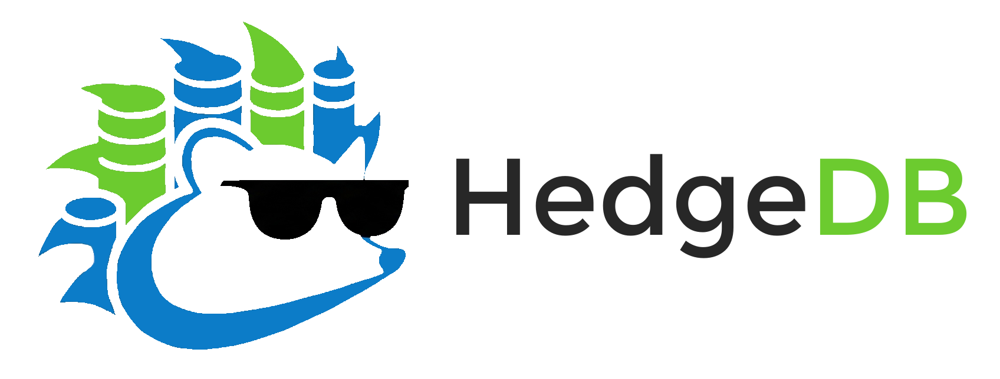

# HedgeDB - _Built for the Hardware_

<p align="center">

</p>

HedgeDB is a key-value store, built on a partitioned LSM-tree, C++20 coroutines, and `io_uring`. Larger-than-memory, persisted, tuned for modern
NVMe SSDs and modern CPUs.

[](https://github.com/fede-vaccaro/HedgeDB)
[](https://github.com/fede-vaccaro/HedgeDB)
[](https://github.com/fede-vaccaro/HedgeDB)
[](https://github.com/fede-vaccaro/HedgeDB/actions/workflows/build.yml)

---

## Features and core design

HedgeDB is an LSM-Tree engine designed to saturate the NVMe device. Inspired by RocksDB, the engine targets write-heavy workloads with uniformly-distributed keys (UUIDs, hashes), and is structured around:

- **Asynchronous execution.** `io_uring` + C++20 coroutines via [TooManyCooks](https://github.com/tzcnt/TooManyCooks),
  a work-stealing scheduler. This allows to perform I/O batching and switching context within user-space.
- **Partitioned LSM-tree.** The key space is sharded into `2^N` independent
  partitions (default 16). Compactions on different partitions run fully in
  parallel.
- **Size-tiered compaction.** Lower write amplification than leveled, with a
  quotient filter on the read path to skip SSTs that can't contain a key.
- **Per-thread WAL.** Each writer thread owns its own WAL file, no inode
  contention on the hot path.
- **Direct I/O.** reads, flush and compactions use `O_DIRECT`: predictable latencies
  and transparent memory usage, with no IO stalls from page-cache pressure.
- **MVCC.** Snapshot isolation over range scans.

---

## Performance

Performance comparison with RocksDB on a **13th Gen Intel i7-13700H**
(6 P-cores + 4 E-cores, 32 GB DDR5 RAM) with a **Samsung 980 Pro 1TB NVMe**;
100M records, 24-byte keys, 100-byte values:

| Workload | HedgeDB | RocksDB | HedgeDB / RocksDB |
|---|---:|---:|---:|
| Load (100M puts)            | **3.97M ops/s** | 1.14M ops/s | **3.5×** |
| Load + compactions drained  | **3.59M ops/s** | 1.13M ops/s | **3.2×** |
| Read (100M random gets)     | **1.03M ops/s** | 194K ops/s  | **5.3×** |
| Mixed 50/50 read-write      | **1.33M ops/s** | 262K ops/s  | **5.1×** |

---

## Quickstart

Linux only. See the [HedgeDB documentation site](https://fede-vaccaro.github.io/hedgedb.github.io/)
for full prerequisites and the larger API surface.

### Dependencies

- Linux kernel `6` or later
- `gcc 13` or later (C++20)
- [`liburing`](https://github.com/axboe/liburing) `2.14`
- Other dependencies are managed via CMake

*Optional but highly recommended:*

- [`hwloc`](https://www.open-mpi.org/projects/hwloc/)
- A concurrency-friendly allocator: [`jemalloc`](https://github.com/jemalloc/jemalloc) or [`tcmalloc`](https://github.com/google/tcmalloc)

### Build

```bash
# install dependencies (liburing is mandatory; hwloc/jemalloc are recommended); full list in .github/workflows/build.yml
sudo sh install_liburing.sh
sudo apt install libhwloc-dev

# configure & build
cmake . -B build -DCMAKE_BUILD_TYPE=Release -DUSE_JEMALLOC=1 -Wno-dev
cmake --build build -j$(nproc)
```

### Try it with `benchtool`

```bash
# Bump the FD limit (HedgeDB keeps many SST files open)
ulimit -n 1048576

# Write 1M keys with 100-byte values, then read them back
./build/benchtool -m load -n 10000000 -v 100 -p /tmp/hedge_demo
./build/benchtool -m read  -n 10000000 -v 100 -p /tmp/hedge_demo
```

| Flag | Long form | Default | Description |
|------|-----------|---------|-------------|
| `-n` | `--num_ops` | `1000000` | number of operations |
| `-v` | `--vsize` | `100` | value size in bytes |
| `-m` | `--mode` | `write` | `write` \| `read` \| `rw` \| `range` |
| `-p` | `--path` | `/tmp/bench_db` | database directory |
| `-s` | `--stats` | `disabled` | collect and print flush/compaction statistics |

### Hello world from the API

A minimal put-then-get-then-print (see `examples/hello_world.cc`):

```cpp
#include <filesystem>
#include <iostream>
#include <string_view>
#include <vector>

#include "db/database.h"
#include "io/static_pool.h"
#include "tmc/sync.hpp"
#include "tmc/task.hpp"

tmc::task<void> run(std::shared_ptr<hedge::db::database> db)
{
    hedge::key_t k{"test_key"};
    std::string v{"Hello, world!"};

    if(auto s = co_await db->put_async(k, std::as_bytes(std::span{v})); !s)
    {
        std::cerr << "put failed: " << s.error().to_string() << "\n";
        co_return;
    }

    auto maybe_value = co_await db->get_async(k);
    if(!maybe_value)
    {
        std::cerr << "get failed: " << maybe_value.error().to_string() << "\n";
        co_return;
    }

    const auto& bytes = maybe_value.value();
    std::string_view readback(reinterpret_cast<const char*>(bytes.data()), bytes.size());
    std::cout << "read back: " << readback << "\n";
}

int main()
{
    const std::filesystem::path db_path = "/tmp/examples_db";
    if(std::filesystem::exists(db_path))
        std::filesystem::remove_all(db_path);

    hedge::io::static_pool::instance()->init(hedge::io::executor_config{
        .name        = "examples-pool",
        .queue_depth = 16,
        .n_threads   = 4,
    });

    auto maybe_db = hedge::db::database::make_new(db_path, hedge::db::db_config{});
    if(!maybe_db)
    {
        std::cerr << "failed to create database: " << maybe_db.error().to_string() << "\n";
        return 1;
    }

    std::shared_ptr<hedge::db::database> db = std::move(maybe_db.value());
    tmc::post_waitable(*hedge::io::static_pool::instance(), run(db)).wait();

    db.reset();
    hedge::io::static_pool::instance()->shutdown();
}
```

### Run tests

```bash
# Increase file descriptors limit
ulimit -n 1048576

# Build tests
cmake -B build -DCMAKE_BUILD_TYPE=Release -DBUILD_TESTS=1 -Wno-dev 
cmake --build build -j$(nproc)

# Run tests 
ctest --test-dir build -V
```

---

## What's missing

HedgeDB is a **prototype**. Things that aren't here yet:

- **Full-fledged crash recovery:** WAL replay works, but partial-write and
  corrupted-file edge cases aren't handled.
- **Battle-testing & hardening:** never run against real-world workloads
  or for long execution periods.
- **Cross-platform support:** Linux only (`io_uring`).
- **Block compression:** many workloads would see meaningful size, space,
  and write-amplification reduction from lossless compression.
- **Batched operations:** no batch put/get APIs to amortize call overhead.
- **Column families:** single keyspace per database.
- **Large values support:** if `key.size() + value.size()` exceeds the
  index-block page size (a bit less than 4 KB), the flush will break.

## Future plans

- **Hyper-Clock Cache:** an approximate LRU cache that trades counting precision
  for a faster algorithm. Works well with Direct I/O.
- **Key-value separation:** SSTs would store keys + pointers, with values in
  separate append-only `.vlog` files. This cuts value write-amplification
  during compaction a lot (paired with a GC story).
- **Rate-limiting:** soft-stall writes when L0 SSTs cross a threshold,
  smoothing long-tail latencies due to compaction backlog.
- *Rewrite in Rust?* 👀

---

_Join us on the [Discord channel](https://discord.gg/kHdxG3AF9x)!_

Built and maintained by [Federico Vaccaro](https://github.com/fede-vaccaro).
